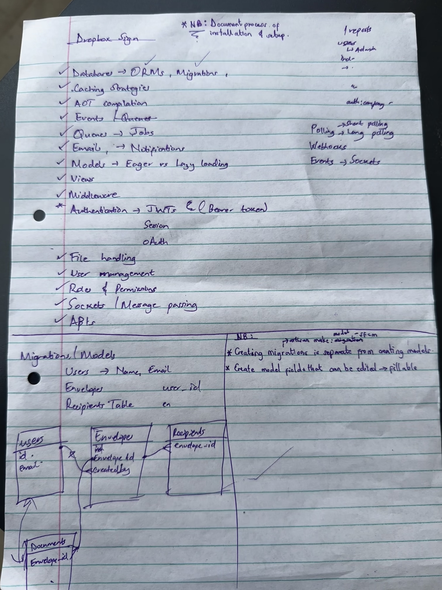

# eSignify API - Easy Electronic Contract Signing with Dropbox Sign

This repository provides an API for integrating document signing with [Dropbox Sign](https://sign.dropbox.com/) (formerly known as HelloSign) into your applications. It allows users to easily sign documents containing terms and conditions.

## Features

-   **Document Signing:** Enable users to electronically sign documents containing terms and conditions with ease.
-   **Dropbox Sign Integration:** Seamlessly integrate with Dropbox Hello to streamline document management and signing processes.

## License

This project is licensed under the [MIT License](LICENSE).

## Plan

